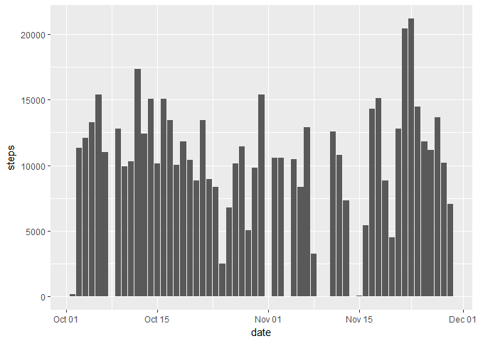
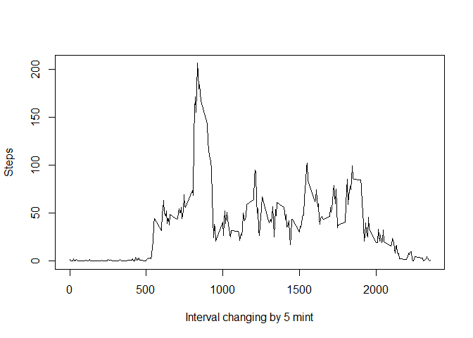

Assignment of Course5week2
==========================

Loading and Preprocessing the Data
----------------------------------

First the data was downloaded, unzipped and then read. After that the
date variable was converted to date class.

    download.file("https://d396qusza40orc.cloudfront.net/repdata%2Fdata%2Factivity.zip", "./course5week2.zip")
    data<-unzip("course5week2.zip")
    data <- read.csv(data)
    data$date<-as.Date(as.character(data$date),"%Y-%m-%d")

Mean Total Number of Steps Taken Per Day With Missing Values Ignored
--------------------------------------------------------------------

Getting data set with no NA values and then summing the steps per days

    dataNoNa<-data[!(is.na(data$steps)),] #getting dataSet with no Na values
    totalStepsPerDay<-aggregate(steps~date,FUN=sum,data = dataNoNa) #summing data

Plotting the total steps per each day

    library(ggplot2)
    p<-ggplot(data=totalStepsPerDay,aes(x=date,y=steps))
    p+geom_col() #plotting 

Calculating Mean and Median of the total number of steps taken per day

    totalMeanStepsPerDay<-aggregate(steps~date,FUN=mean,data = dataNoNa) #getting mean of steps per days
    totalMedianStepsPerDay<-aggregate(steps~date,FUN=median,data = dataNoNa) #getting median of steps per days
    meanAndMedian<-merge(totalMeanStepsPerDay,totalMedianStepsPerDay,by="date") #merging data by means of date
    names(meanAndMedian)<-c("Date","mean of Steps","median of steps") # changing name
    meanAndMedian

    ##          Date mean of Steps median of steps
    ## 1  2012-10-02     0.4375000               0
    ## 2  2012-10-03    39.4166667               0
    ## 3  2012-10-04    42.0694444               0
    ## 4  2012-10-05    46.1597222               0
    ## 5  2012-10-06    53.5416667               0
    ## 6  2012-10-07    38.2465278               0
    ## 7  2012-10-09    44.4826389               0
    ## 8  2012-10-10    34.3750000               0
    ## 9  2012-10-11    35.7777778               0
    ## 10 2012-10-12    60.3541667               0
    ## 11 2012-10-13    43.1458333               0
    ## 12 2012-10-14    52.4236111               0
    ## 13 2012-10-15    35.2048611               0
    ## 14 2012-10-16    52.3750000               0
    ## 15 2012-10-17    46.7083333               0
    ## 16 2012-10-18    34.9166667               0
    ## 17 2012-10-19    41.0729167               0
    ## 18 2012-10-20    36.0937500               0
    ## 19 2012-10-21    30.6284722               0
    ## 20 2012-10-22    46.7361111               0
    ## 21 2012-10-23    30.9652778               0
    ## 22 2012-10-24    29.0104167               0
    ## 23 2012-10-25     8.6527778               0
    ## 24 2012-10-26    23.5347222               0
    ## 25 2012-10-27    35.1354167               0
    ## 26 2012-10-28    39.7847222               0
    ## 27 2012-10-29    17.4236111               0
    ## 28 2012-10-30    34.0937500               0
    ## 29 2012-10-31    53.5208333               0
    ## 30 2012-11-02    36.8055556               0
    ## 31 2012-11-03    36.7048611               0
    ## 32 2012-11-05    36.2465278               0
    ## 33 2012-11-06    28.9375000               0
    ## 34 2012-11-07    44.7326389               0
    ## 35 2012-11-08    11.1770833               0
    ## 36 2012-11-11    43.7777778               0
    ## 37 2012-11-12    37.3784722               0
    ## 38 2012-11-13    25.4722222               0
    ## 39 2012-11-15     0.1423611               0
    ## 40 2012-11-16    18.8923611               0
    ## 41 2012-11-17    49.7881944               0
    ## 42 2012-11-18    52.4652778               0
    ## 43 2012-11-19    30.6979167               0
    ## 44 2012-11-20    15.5277778               0
    ## 45 2012-11-21    44.3993056               0
    ## 46 2012-11-22    70.9270833               0
    ## 47 2012-11-23    73.5902778               0
    ## 48 2012-11-24    50.2708333               0
    ## 49 2012-11-25    41.0902778               0
    ## 50 2012-11-26    38.7569444               0
    ## 51 2012-11-27    47.3819444               0
    ## 52 2012-11-28    35.3576389               0
    ## 53 2012-11-29    24.4687500               0

The Average Daily Activity Pattern
----------------------------------

Now we will average all steps per each 5 mint interval

    totalStepsPertime<-aggregate(steps~interval,FUN=mean,data = dataNoNa) #For Making a time series plotof the 5-minute interval (x-axis) and the average number of steps taken, averaged across all days (y-axis)
    plot(totalStepsPertime$interval,totalStepsPertime$steps,type = "l",xlab = "Interval changing by 5 mint",ylab = "Steps")

    totalStepsPertime[totalStepsPertime$steps==max(totalStepsPertime$steps),] #showing at which interval maximum steps occur

    ##     interval    steps
    ## 104      835 206.1698

Imputing Missing Values
-----------------------

First shwoing the no of rows having missing values

    dataWithNa<-data[is.na(data$steps),]
    missingValues<-nrow(dataWithNa) #showing missing Values
    missingValues

    ## [1] 2304

To compute the missing values, average of all days was taken on each 5
mint interval from the data having no missng values. Then this average
steps were included in the Na values of the missing data with the
correct time interval

    totalStepsPertime<-aggregate(steps~interval,FUN=mean,data = dataNoNa)
    includingDataForNa<-merge(totalStepsPertime,dataWithNa,by="interval")
    includingDataForNa$steps.y<-NULL # deleting the steps.y variable.
    colnames(includingDataForNa)[2]<-"steps"  #changing name of the variable
    completeData<-rbind(includingDataForNa,dataNoNa)  #combining data of cpmute values and predata values
    library(dplyr)

    ## 
    ## Attaching package: 'dplyr'

    ## The following objects are masked from 'package:stats':
    ## 
    ##     filter, lag

    ## The following objects are masked from 'package:base':
    ## 
    ##     intersect, setdiff, setequal, union

    completeData<-arrange(completeData,date) # complete data arranged by date

A histogram of the total number of steps taken each day and Calculating
and reporting the mean and median total number of steps taken per day

    totalStepsPerDayx<-aggregate(steps~date,FUN=sum,data = completeData) #computing total steps per day for the new data
    q<-ggplot(data=totalStepsPerDayx,aes(x=date,y=steps))
    q+geom_col() #plotting histogram

    totalMeanStepsPerDayx<-aggregate(steps~date,FUN=mean,data = completeData) #getting mean of steps per days
    totalMedianStepsPerDayx<-aggregate(steps~date,FUN=median,data = completeData) #getting median of steps per days
    meanAndMedianx<-merge(totalMeanStepsPerDayx,totalMedianStepsPerDay,by="date") #merging data by means of date
    names(meanAndMedianx)<-c("Date","mean of Steps","median of steps") # changing name
    meanAndMedianx

    ##          Date mean of Steps median of steps
    ## 1  2012-10-02     0.4375000               0
    ## 2  2012-10-03    39.4166667               0
    ## 3  2012-10-04    42.0694444               0
    ## 4  2012-10-05    46.1597222               0
    ## 5  2012-10-06    53.5416667               0
    ## 6  2012-10-07    38.2465278               0
    ## 7  2012-10-09    44.4826389               0
    ## 8  2012-10-10    34.3750000               0
    ## 9  2012-10-11    35.7777778               0
    ## 10 2012-10-12    60.3541667               0
    ## 11 2012-10-13    43.1458333               0
    ## 12 2012-10-14    52.4236111               0
    ## 13 2012-10-15    35.2048611               0
    ## 14 2012-10-16    52.3750000               0
    ## 15 2012-10-17    46.7083333               0
    ## 16 2012-10-18    34.9166667               0
    ## 17 2012-10-19    41.0729167               0
    ## 18 2012-10-20    36.0937500               0
    ## 19 2012-10-21    30.6284722               0
    ## 20 2012-10-22    46.7361111               0
    ## 21 2012-10-23    30.9652778               0
    ## 22 2012-10-24    29.0104167               0
    ## 23 2012-10-25     8.6527778               0
    ## 24 2012-10-26    23.5347222               0
    ## 25 2012-10-27    35.1354167               0
    ## 26 2012-10-28    39.7847222               0
    ## 27 2012-10-29    17.4236111               0
    ## 28 2012-10-30    34.0937500               0
    ## 29 2012-10-31    53.5208333               0
    ## 30 2012-11-02    36.8055556               0
    ## 31 2012-11-03    36.7048611               0
    ## 32 2012-11-05    36.2465278               0
    ## 33 2012-11-06    28.9375000               0
    ## 34 2012-11-07    44.7326389               0
    ## 35 2012-11-08    11.1770833               0
    ## 36 2012-11-11    43.7777778               0
    ## 37 2012-11-12    37.3784722               0
    ## 38 2012-11-13    25.4722222               0
    ## 39 2012-11-15     0.1423611               0
    ## 40 2012-11-16    18.8923611               0
    ## 41 2012-11-17    49.7881944               0
    ## 42 2012-11-18    52.4652778               0
    ## 43 2012-11-19    30.6979167               0
    ## 44 2012-11-20    15.5277778               0
    ## 45 2012-11-21    44.3993056               0
    ## 46 2012-11-22    70.9270833               0
    ## 47 2012-11-23    73.5902778               0
    ## 48 2012-11-24    50.2708333               0
    ## 49 2012-11-25    41.0902778               0
    ## 50 2012-11-26    38.7569444               0
    ## 51 2012-11-27    47.3819444               0
    ## 52 2012-11-28    35.3576389               0
    ## 53 2012-11-29    24.4687500               0

By following the mean method for imputing values there is no change in
the mean and median when compare to the mean and median calculated from
Na values removed data.

    changeInmean<-meanAndMedian$`mean of Steps`- meanAndMedianx$`mean of Steps`
    table(changeInmean)

    ## changeInmean
    ##  0 
    ## 53

    changeInMedian <-meanAndMedian$`median of steps` - meanAndMedianx$`median of steps`
    table(changeInMedian)

    ## changeInMedian
    ##  0 
    ## 53

Seeing Differences In Activity Patterns Between Weekdays and Weekends
---------------------------------------------------------------------

Creating a new factor variable in the dataset with two levels -
"weekday" and "weekend" indicating whether a given date is a weekday or
weekend day.

    weekdaysOfMonth <- c('Monday', 'Tuesday', 'Wednesday', 'Thursday', 'Friday') #creating a factor variable of weekday and weekend
    completeData$whichDay <- factor((weekdays(completeData$date) %in% weekdaysOfMonth), 
                       levels=c(FALSE, TRUE), labels=c('weekend', 'weekday') )

Making a panel plot containing a time series plot of the 5-minute
interval (x-axis) and the average number of steps taken, averaged across
all weekday days or weekend days (y-axis).

    meanWrtIntervalAndDays<-aggregate(steps~interval+whichDay,FUN=mean,data = completeData) #arranging data with respect to days and interval
    qplot(interval,steps,data = meanWrtIntervalAndDays,geom = c("line"),facets = .~whichDay)

